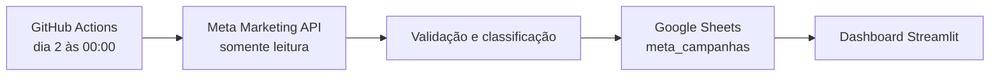

# Automação da aba `meta_campanhas`

## O que a automação faz

No dia 2 de cada mês, às 00:00 no fuso `America/Sao_Paulo`, o GitHub Actions:

1. calcula o mês completo anterior;
2. consulta a conta **NextQS Brasil** pela Meta Marketing API;
3. valida conta, moeda, período, paginação e total investido;
4. classifica cada anúncio com base no histórico validado ou nos campos nativos da Meta;
5. atualiza a aba `meta_campanhas` da planilha NextQS;
6. relê a planilha e confirma a escrita e a preservação dos campos manuais.

O dashboard continua lendo a planilha. A integração não altera o código de leitura do Streamlit nem grava dados diretamente no dashboard.

## Colunas da planilha

| Colunas | Conteúdo | Responsável |
|---|---|---|
| A:N | mês, plataforma, destino, objetivo, link do criativo e métricas da Meta | automação |
| O:P | oportunidades e negócios | preenchimento manual/processo comercial |
| Q:S | IDs técnicos de anúncio, conjunto e campanha | automação |

O link do criativo na coluna E é preservado quando a linha já existe, porque pode ter sido curado manualmente. As colunas O:P nunca são incluídas nas atualizações da automação. As colunas Q:S podem ser ocultadas na interface da planilha, mas não devem ser renomeadas ou removidas.

## Correspondência de métricas

| Objetivo exibido no dashboard | Campo/evento consultado na Meta |
|---|---|
| Conversas | `onsite_conversion.messaging_conversation_started_7d` |
| Lead Site | `offsite_conversion.fb_pixel_lead` |
| Lead Formulário | `onsite_conversion.lead_grouped` |
| Visitas ao Perfil do Instagram | `instagram_profile_visits` |

Investimento, alcance, impressões e cliques no link vêm dos campos do relatório por anúncio e plataforma. CTR, CPM e custo por resultado são calculados a partir desses valores.

## Credenciais

O repositório usa dois GitHub Actions secrets:

- `META_ACCESS_TOKEN`: token do usuário do sistema com leitura da conta de anúncios;
- `GCP_SERVICE_ACCOUNT_JSON`: chave JSON da conta de serviço autorizada na planilha.

Os valores não ficam no código, nos logs ou nos artefatos do workflow. A API da Meta é usada apenas para leitura. A escrita ocorre somente na planilha Google autorizada.

O token da Meta pode deixar de funcionar depois de uma alteração de permissões, política de segurança ou revogação. Nesse caso, gere outro token para o mesmo usuário do sistema e substitua somente o secret `META_ACCESS_TOKEN` em **Settings → Secrets and variables → Actions** no GitHub. Para a credencial Google, gere uma nova chave para a mesma conta de serviço, atualize `GCP_SERVICE_ACCOUNT_JSON` e revogue a chave anterior.

## Execução manual

Em **Actions → Sincronizar relatório mensal Meta → Run workflow**, informe opcionalmente um mês no formato `YYYY-MM` e escolha um modo:

- `validate`: compara um mês já existente com a Meta e não escreve;
- `backfill_ids`: preenche Q:S em um mês histórico já reconciliado;
- `write`: coleta, valida, atualiza A:N/Q:S e verifica a escrita.

Uma execução agendada sempre usa `write` e o mês completo anterior. A execução pode começar alguns minutos depois do horário marcado por causa da fila do GitHub Actions.

## Proteções e comportamento em falhas

A atualização é interrompida antes da escrita quando encontra conta/moeda divergente, mês ainda aberto, resposta vazia, paginação incompleta, total inconsistente, plataforma desconhecida, link inválido, IDs ausentes ou classificação ambígua. Linhas históricas que desaparecerem da resposta da Meta também bloqueiam a atualização, em vez de serem apagadas.

Depois da gravação, o processo relê a planilha e confere texto, métricas, IDs técnicos e as colunas O:P. Uma nova execução do mesmo mês é idempotente: com os mesmos dados da Meta, nenhuma célula muda.

Se a Meta fizer atribuições tardias dentro de um mês encerrado, uma nova execução de `write` atualiza as métricas automáticas para o valor mais recente e mantém E e O:P.

## Anúncios novos

Anúncios novos são classificados automaticamente quando usam uma destas combinações nativas:

- destino WhatsApp com otimização para conversas;
- destino perfil do Instagram com otimização para visita ao perfil;
- formulário instantâneo com otimização para geração de cadastro.

Se a Meta retornar uma combinação diferente ou ambígua, o workflow falha sem escrever. Faça a classificação inicial na planilha, execute `backfill_ids` para o mês e depois repita `write`. Essa trava evita registrar um tipo de resultado incorreto.

## Validação realizada na implantação

- 31 testes automatizados aprovados;
- 57 linhas históricas de janeiro a agosto de 2026 reconciliadas e vinculadas aos IDs Meta;
- primeira escrita real de agosto de 2026 concluída e verificada;
- nenhuma alteração nos links curados nem nas colunas O:P;
- segunda escrita do mesmo mês com zero alterações, confirmando idempotência.

## Custo e disponibilidade

No volume atual, a solução usa as cotas gratuitas da Meta Marketing API, Google Sheets API, GitHub Actions para repositório público e Streamlit Community Cloud. Não há servidor adicional.

O GitHub pode desativar workflows agendados em repositórios públicos sem atividade por 60 dias. Se o relatório deixar de rodar, abra a aba Actions, reative o workflow e execute `write` manualmente para o mês pendente.
